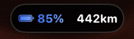
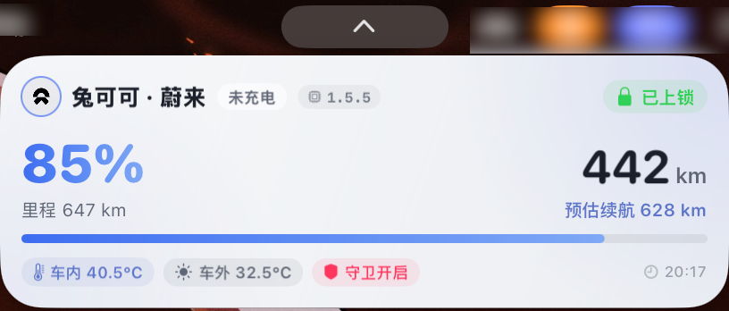

<h1 align="center">🐰 YumikoToysRR for NIO (iOS)</h1>

<p align="center">
  
  <br>
  
</p>

<p align="center">
  <strong>专为蔚来车主打造的二次元萌动艺术风车况看板 · 灵动岛 (Dynamic Island) 与锁屏实时活动 (Live Activity) 智能助理</strong>
</p>

<p align="center">
  
  
  
  
  
</p>

---

## ✨ 核心功能矩阵（27 大全景车况与服务系统）

### 1. 🔋 动力电池与高压快充大屏
- **全维高压大电池诊断**：实时剩余电量（SOC）、标称与实估续航里程、总里程、达成率动态能量条。
- **⚡️ 高压快充详情大屏**：实时充电功率（kW）、充电电流（A）、充电电压（V）、目标限充百分比、充满预估时间倒计时、充电桩类型自动辨识（交流慢充 / 直流快充 / 超充桩 / 换电站充电机 / V2L 对外放电）。

### 2. 🪟 车门、车窗与全景天幕透视
- **车门门锁透视**：4 门独立开闭状态、全车防盗锁、前机舱盖、电动尾门、充电口盖状态。
- **车窗与天窗开度**：4 门车窗独立开度百分比（0-100% 动态能量条）、全景天窗天幕开度、后视镜折叠状态感知。

### 3. 🚗 驾驶模式与行车泊车全景
- **驾驶模式全维感知**：舒适、节能、运动、运动+、个性化、雪地、沙地、湿地模式，驻车时智能提示「上次设定模式」。
- **车辆挡位与泊车状态**：实时车速、P/D/R 挡位、遥控泊车辅助（RPA）进行中与待命状态、行程分享状态。

### 4. 🛞 四轮胎压、温度与 12V 小电瓶
- **4 轮胎压与胎温监测**：四轮独立压温网格、冷车推荐气压、胎压告警与休眠智能继承。
- **🔑 智能钥匙与 12V 低压蓄电池**：12V 辅助电瓶实时精准电压（如 `12.8V 优良`）、电瓶健康度评级、蓝牙靠近感应、感应门把手伸出状态。

### 5. 🌡️ 座舱温湿度、舒适与空气健康
- **温暖座舱与空调干燥**：车内外双温差显示、空调运行状态、高温超强干燥、极速除霜、极速冷热、座舱过热保护。
- **🪑 座椅舒适与方向盘加热**：方向盘加热档位、4 座独立加热与通风档位、动力电池预热与保温状态。
- **🧊 车载智能冰箱与空气健康**：车载冰箱电源与当前/目标温度、PM2.5 车内外空气质量检测。
- **📦 储物空间与行李箱状态**：前机舱盖/前备箱开闭、电动尾门/后备箱开闭、中控密码手套箱上锁状态。
- **💡 车外灯光与照明系统**：近光灯、远光灯、示宽灯、双闪危险警报灯拟物化语义展示。

### 6. 📍 高精位置、地图导航与行车轨迹回放
- **高精停车位置与纠偏**：WGS-84 地球坐标转 GCJ-02 高精纠偏，一键调起高德地图 / 百度地图 / Apple 地图导航寻车。
- **🗺️ 历史行驶轨迹地图**：当日行驶轨迹连线渲染、起点终点标记、行驶距离统计与时间轴回放。

### 7. 🛡️ 守卫模式与远程车控
- **特殊驻车模式**：守卫模式（Sentry）、宠物模式、露营模式、离车不下电、车机在线/离线状态。
- **⚡️ 远程智能车控**：闪灯鸣笛寻车、远程开闭空调、车锁解锁/上锁、极速除霜干燥。

### 8. 📑 换电站足迹与财务大屏
- **换电大屏**：累计换电次数、总花费支出、常用换电站 Top 排行榜。
- **服务工单手风琴**：最近换电与维保订单列表，支持一键展开查看服务站地址、工单号、支付明细。

### 9. 📈 能耗达成率与多维趋势图表
- **百公里电耗评分**：达成率动态计算、推算百公里电耗（kWh/100km）能耗评分。
- **📊 趋势图表分析**：每日里程增量柱状图、电池容量衰减健康曲线、历史快照趋势。

### 10. 🔧 维保周期与签到成就
- **维保耗材寿命**：空调滤芯、刹车油、齿轮箱油等耗材寿命倒计时天数与剩余公里数。
- **📅 签到连击与里程成就**：自动签到、连续签到天数、积分累积统计、里程成就勋章。

### 11. 🔍 诊断、日志与底层 JSON 检视
- **📜 抓包请求与运行日志**：请求历史列表、URL、状态码、响应耗时（ms）、一键复制 cURL/JSON。
- **底层 JSON 实时检视**：每张卡片右上角配备 `{ }` 按钮，一键弹出查看底层 RVS 数据结构并支持一键复制。

### 12. 🎨 萌系动漫艺术风与个性化
- **车型与涂装定制**：ET5 / ET5T / ET7 / ES6 / EC6 / ES8 / ET9 等各车型与多款官方专属车漆。
- **二次元主题系统**：樱花粉、薄荷青、薰衣草紫、暖阳黄等 6 套主题色，支持粒子特效与省电模式。

### 13. 📱 灵动岛 (Dynamic Island) 与实时活动 (Live Activity)
- 息屏/锁屏即时查看电量、续航、车锁状态、充电功率与充满倒计时；
- 展开区直观呈现 4 轮胎压、车内外温差、车载冰箱、守卫模式告警与车机固件版本胶囊。

---

## 🔄 双引擎数据获取与自动容灾体系

```
                    ┌───────────────────────────────────────────┐
                    │            用户配置 / 数据拉取触发           │
                    └─────────────────────┬─────────────────────┘
                                          │
                   ┌──────────────────────┴──────────────────────┐
                   ▼                                             ▼
       【模式 A：Shadowrocket 抓包模式】              【模式 B：Widget 动态签名模式】
        (icar.nio.com 全量 RVS 数据源)                 (app.nio.com 小组件轻量数据源)
                   │                                             │
      包含全部 24 个深度状态块:                               包含 6-8 个核心基础状态块:
      • 12V 小电瓶电压/健康度                                  • 高压电量 SoC / 续航里程
      • 智能钥匙/蓝牙靠近感应                                  • 4 门开闭与整车车锁
      • 座椅通风加热/方向盘加热                                • 车辆实时位置 GPS
      • 4 门车窗天幕独立开度                                   • 胎压与基本状态
      • 车载冰箱/储物箱/车外灯光                                         │
                   │                                                     │
                   ▼                                                     ▼
      ┌─────────────────────────┐                           ┌─────────────────────────┐
      │  每次抓包捕获全量数据包   │                           │  动态计算 Sign，永不过期  │
      │  自动触发 7 大缓存落盘   │                           │  日常高频轮询，安全稳定  │
      └────────────┬────────────┘                           └────────────┬────────────┘
                   │                                                     │
                   └──────────────────────┬──────────────────────────────┘
                                          ▼
                   ┌───────────────────────────────────────────┐
                   │       ⚡️ 智能数据继承与融合渲染引擎       │
                   │ (当 Widget 模式缺少小电瓶/座椅/车窗等块时，  │
                   │  自动无缝继承并渲染本地缓存中的真实有效数据)  │
                   └───────────────────────────────────────────┘
```

- **7 大高级数据本地持久化继承**：`cached-tyre.json`、`cached-lv-batt.json`、`cached-key.json`、`cached-heating.json`、`cached-window.json`、`cached-frdg.json`、`cached-box.json`、`cached-light.json`。
- 即使在日常使用 Widget 动态签名模式下，小电瓶、座椅加热、车窗开度等数据也始终保持最新状态，绝不空白！

---

## 📱 Shadowrocket / BoxJS 抓包与配置指引

### 方法一：Shadowrocket（小火箭）自动捕获模块
1. 在 Shadowrocket 中添加模块脚本订阅，开启 HTTPS 解密；
2. 打开手机 **蔚来 App**，进入「爱车」页面下拉刷新一次；
3. 小火箭会自动捕获全量 RVS 状态包，并把 Vehicle ID、Device ID、Sign Secret 自动同步或保存；
4. 将参数粘贴到 YumikoToysRR 中点击「测试连接」即可！

### 方法二：Widget 动态签名模式（推荐）
1. 在 App 设置中填入 **Vehicle ID**、**Device ID** 与 **Sign Secret**；
2. 应用将在每次请求时动态计算 MD5 时间戳签名，**永久不再过期**！

---

## 📦 安装说明 (Installation)

### 方式一：下载 Release 预编译 IPA（推荐）
1. 前往 GitHub [Releases](../../releases) 页面，下载最新的 `YumikoToysRR-unsigned.ipa`；
2. 使用 **TrollStore（巨魔商店）**、**Sideloadly**、**AltStore** 或个人证书直接签名安装；
3. 自带灵动岛与锁屏实时活动扩展插件 (`WheaterStatusExtension.appex`)。

### 方式二：Xcode 源码编译
1. 克隆本仓库：
   ```bash
   git clone https://github.com/kissggj123/NIO-Dash-iOS.git
   cd NIO-Dash-iOS
   ```
2. 使用 Xcode 打开 `YumikoToysRR.xcodeproj`；
3. 在 `Signing & Capabilities` 中配置您的开发者账号证书，选择真机运行安装即可。

---

## 🌲 项目结构 (Directory Tree)

```text
YumikoToysRR-Weather/
├── WheaterStatus/                      # 灵动岛 (Dynamic Island) 与锁屏实时活动 Widget 扩展
│   ├── WheaterStatus.swift             # 实时活动 UI 渲染（紧凑岛、展开岛、锁屏大卡片）
│   ├── WheaterStatus.intentdefinition  # WidgetKit 意图配置
│   ├── Info.plist                      # Widget 扩展权限配置
│   └── Assets.xcassets                 # 小组件专属素材与颜色令牌
├── wheater/                            # iOS 主应用程序源码
│   ├── Model/                          # 数据模型与核心算法库
│   │   ├── NIO/
│   │   │   ├── NIOModels.swift         # 蔚来 API 数据结构定义 (SOC/车门/空调/胎压/维保/充电/车窗/冰箱等)
│   │   │   ├── NIOVehicleLib.swift     # 电池容量推算、坐标纠偏、达成率算法、动态重签名引擎与主题令牌
│   │   │   ├── NIOOrderLib.swift       # 换电/维保订单账单与常用换电站排行解析库
│   │   │   └── NIOCheckinLib.swift     # 车主每日签到与积分统计
│   │   └── WheaterAttributes.swift     # 跨进程 Live Activity 数据通信契约与指纹去重
│   ├── ViewModel/                      # 业务逻辑与网络服务
│   │   └── NIOService.swift            # 蔚来双引擎通信协议、7大状态块持久化继承、后台轮询、灵动岛生命周期
│   ├── Views/                          # SwiftUI 视图组件层
│   │   ├── NIO/
│   │   │   ├── IOSNIODashboardView.swift    # 蔚来 27 大全景车况卡片主看板
│   │   │   ├── IOSNIOConfigView.swift       # 车机凭证配置、抓包日志查看、车型涂装与连通性测试
│   │   │   ├── IOSAboutView.swift           # 关于兔可可、功能矩阵与版本说明
│   │   │   └── NIOPixelLaunchSplashView.swift # 像素风开屏启动动效
│   │   └── ContentView.swift           # App 根路由与全局主题渲染上下文
│   ├── Resources/                      # 静态资源库
│   │   ├── Brand/                      # 蔚来品牌 Logo 与矢量图标
│   │   └── Cars/                       # 10 款全系蔚来车型高清 3D 渲染图与车身色库
│   └── wheaterApp.swift                # iOS 应用程序主入口
└── YumikoToysRR.xcodeproj              # Xcode 完整工程配置与多 Target 架构
```

---

## 🛠️ 技术架构

- **UI 渲染**：SwiftUI（100% 声明式原生组件，支持 120 FPS 高刷 ProMotion）
- **实时活动**：ActivityKit + WidgetKit
- **架构模式**：MVVM + Clean Architecture 分层架构
- **数据保活与继承**：7 大状态块异步落盘与自适应指纹对比算法

---

## 🙏 致谢与灵感来源 (Acknowledgements)

本项目在接口逆向、数据结构设计与车况监控逻辑上深受以下优秀的开源项目启发，在此致以诚挚的感谢：

- [real3841/NIO-Dash](https://github.com/real3841/NIO-Dash) - 优秀的蔚来车况仪表板与数据可视化方案
- [genelee26/ha-nio](https://github.com/genelee26/ha-nio) - 蔚来车辆 Home Assistant 集成插件与 API 协议参考

---

## 📄 开源许可证

本项目基于 [MIT License](LICENSE) 协议开源。
